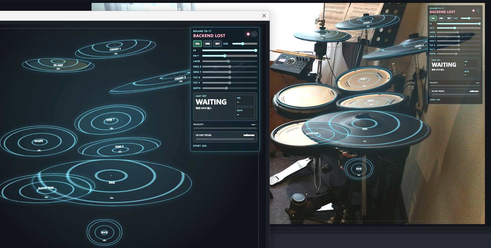

# drumkit-visual

A lightweight real-time MIDI monitor and browser overlay backend for Roland TD-17 electronic drums.

This project listens to MIDI input from a Roland TD-17 drum module, parses basic drum hit events, and sends them to a browser-based frontend through WebSocket. It is intended for drum practice visualization, livestream overlays, and later expansion into camera-aligned drum hit effects.



## Features

- Detect Roland TD-17 MIDI connection status
- Listen to real-time MIDI input
- Display recent drum hits, note number, velocity, and raw MIDI bytes
- Read hi-hat pedal state from MIDI CC#4
- Basic visual feedback for kick, snare, toms, hi-hat, crash, and ride
- Runs as a local web app
- Can be used in OBS as a Browser Source
- Can be shared temporarily through Cloudflare Tunnel

## Current Status

This is an early prototype.

Currently implemented:

- TD-17 MIDI device detection
- Basic MIDI event parsing
- WebSocket communication between backend and frontend
- Simple browser-based HUD display

Planned:

- Camera-aligned 2D drum overlay
- Manual layout calibration
- Per-drum hit animations
- Better TD-17 note mapping customization
- OBS-friendly transparent overlay mode

## Requirements

- Python 3.12+
- Roland TD-17 connected via USB MIDI
- A modern browser
- Optional: OBS Studio for livestream overlay usage
- Optional: Cloudflare Tunnel for temporary remote sharing

## Setup with uv

Create and sync the virtual environment:

```bash
uv sync
```

Run the backend:

```bash
uv run python backend/main.py
```

Then open:

```text
http://localhost:8765
```

If the TD-17 is connected correctly, the page should show the device as online. Drum hits will appear in real time with note, velocity, and raw MIDI data.

## Setup with pip

If you are not using `uv`, create a virtual environment manually:

```bash
python -m venv .venv
```

On Windows PowerShell:

```powershell
.venv\Scripts\Activate.ps1
```

On macOS / Linux:

```bash
source .venv/bin/activate
```

Install dependencies:

```bash
pip install aiohttp mido python-rtmidi
```

Run:

```bash
python backend/main.py
```

## OBS Usage

Add a Browser Source in OBS and use:

```text
http://localhost:8765
```

For local network access, make sure the backend listens on `0.0.0.0`, then open:

```text
http://<your-computer-lan-ip>:8765
```

## Cloudflare Tunnel

For temporary remote sharing:

```bash
cloudflared tunnel --url http://localhost:8765
```

Then open the generated `trycloudflare.com` URL.

## MIDI Notes

The project currently uses the default Roland TD-17 note map as a starting point. Actual note assignments may vary depending on kit settings.

Typical mappings include:

```text
36  Kick
38  Snare head
40  Snare rim
48  Tom 1
45  Tom 2
43  Tom 3
42  Closed hi-hat
46  Open hi-hat
49  Crash 1
51  Ride bow
53  Ride bell
```

Hi-hat pedal position is read from MIDI Control Change `CC#4`.

## Notes

This project does not generate audio and does not modify TD-17 settings. It only listens to MIDI input and visualizes incoming events.

## License

MIT
